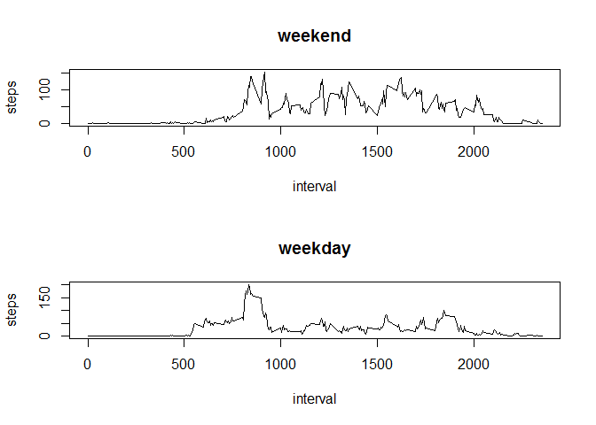

# Reproducible Research: Peer Assessment 1


```r
knitr::opts_chunk$set(echo = TRUE)
```


## Loading and preprocessing the data

```r
workingDir <- "C:\\Users\\work\\Desktop\\DataScience\\WorkingDir\\"
assignmentDir <- "ReproducibleResearch"

unzip("activity.zip")
data <- read.csv(file='activity.csv',sep=',',header=T)
summary(data)
```

```
##      steps                date          interval     
##  Min.   :  0.00   2012-10-01:  288   Min.   :   0.0  
##  1st Qu.:  0.00   2012-10-02:  288   1st Qu.: 588.8  
##  Median :  0.00   2012-10-03:  288   Median :1177.5  
##  Mean   : 37.38   2012-10-04:  288   Mean   :1177.5  
##  3rd Qu.: 12.00   2012-10-05:  288   3rd Qu.:1766.2  
##  Max.   :806.00   2012-10-06:  288   Max.   :2355.0  
##  NA's   :2304     (Other)   :15840
```


## What is mean total number of steps taken per day?

```r
hist(tapply(data$steps,data$date,sum), main = paste("Total Number of Steps Taken/Day"), xlab="Step Count Buckets")
```

<!-- -->


## Calculate and report the mean and median of the total number of steps taken per day

```r
meanNumber <- mean(tapply(data$steps,data$date,sum),na.rm=TRUE)
medianNumber <- median(tapply(data$steps,data$date,sum),na.rm=TRUE)
meanNumber
```

```
## [1] 10766.19
```

```r
medianNumber
```

```
## [1] 10765
```


## What is the average daily activity pattern?
### Make a time series plot (i.e. type = "l") of the 5-minute interval (x-axis) and the average number of steps taken, averaged across all days (y-axis)

```r
avgSteps <- tapply(data$steps,data$interval,mean,na.rm=TRUE)
plot(names(avgSteps), avgSteps, type="l", main = "Time Series Plot", xlab="Interval", ylab="Average Steps")
```

<!-- -->


### Which 5-minute interval, on average across all the days in the dataset, 
### contains the maximum number of steps?

```r
as.numeric(names(which.max(avgSteps)))
```

```
## [1] 835
```


## Imputing missing values
### Calculate and report the total number of missing values

```r
sum(is.na(data))
```

```
## [1] 2304
```

### Devise a strategy for filling in all of the missing values in the dataset.
### We will replace each NA in a day with the mean for that day.  
### If there are no values for a day, leave it as NAN.
### Create a new dataset that is equal to the original dataset but with the missing data filled in.

```r
library(plyr)
impute.mean <- function(x) replace(x, is.na(x), mean(x, na.rm = TRUE))
data2 <- ddply(data, ~ date, transform, steps = impute.mean(steps))
data2$steps <- replace(data2$steps, is.nan(data2$steps), 0)
#data
#data2[order(data2$date), ] #plyr orders by group so we have to reorder
```

### Make a histogram of the total number of steps taken each day.

```r
hist(tapply(data2$steps,data2$date,sum), main = paste("Total Number of Steps Taken/Day"), xlab="Step Count Buckets")
```

<!-- -->

### Calculate and report the mean and median total number of steps taken per day. 

```r
meanNumber2 <- mean(tapply(data2$steps,data2$date,sum),na.rm=TRUE)
medianNumber2 <- median(tapply(data2$steps,data2$date,sum),na.rm=TRUE)
meanNumber2
```

```
## [1] 9354.23
```

```r
medianNumber2
```

```
## [1] 10395
```

### Do these values differ from the estimates from the first part of the assignment? 
#### Yes.

### What is the impact of imputing missing data on the estimates of the total daily number of steps?
#### Both mean and median decreased due to i) an increase in zero value numbers in the denominator of
#### calculations and ii) NA data typically existed within entire days meaning replacing NA's with the
#### mean steps for the day typically yielded a mean of 0 for each interval and for the day.


## Are there differences in activity patterns between weekdays and weekends?
### Create a new factor variable in the dataset with two levels - 
### "weekday" and "weekend" indicating whether a given date is a 
### weekday or weekend day.

```r
daycat <- function(date) {
    if (weekdays(as.Date(date)) %in% c("Saturday", "Sunday")) {
        "weekend"
    } else {
        "weekday"
    }
}
data2$daycat <- as.factor(sapply(data2$date, daycat))
```

### Make a panel plot containing a time series plot (i.e. type = "l") 
### of the 5-minute interval (x-axis) and the average number of steps 
### taken, averaged across all weekday days or weekend days (y-axis)

```r
par(mfrow = c(2, 1))
for (cat in c("weekend", "weekday")) {
    steps.cat <- aggregate(steps ~ interval, data = data2, subset = data2$daycat == 
        cat, FUN = mean)
    plot(steps.cat, type = "l", main = cat)
}
```

<!-- -->

